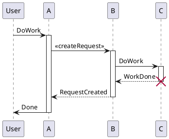
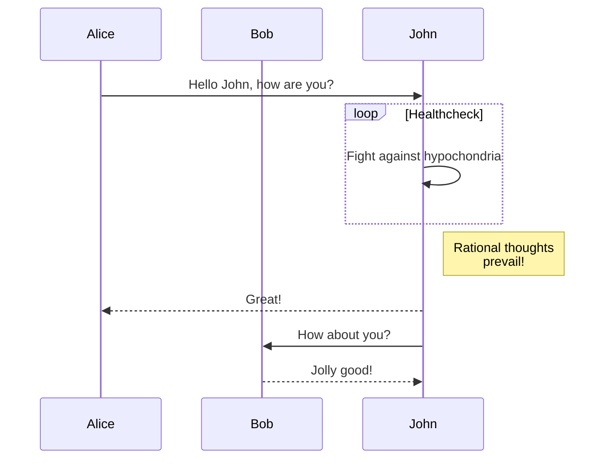
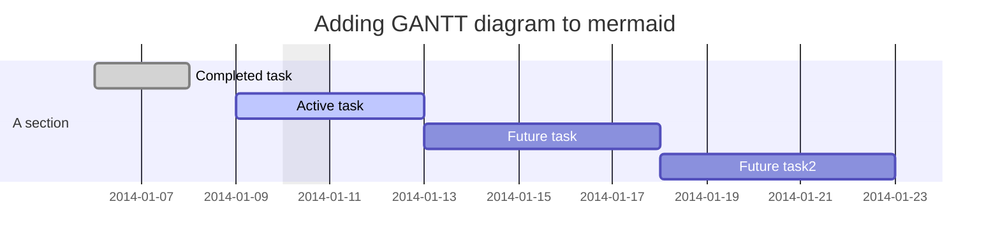

# [toc]

<h1 align="center"><a herf="https://jhuix-js.github.io/imark"> iMark's Features</a></h1>

**[iMark](https://github.com/jhuix-js/imark) is a javascript's lib that make markdown to html with some extensions features.**

**It support common markdown syntax, refer to the document -- [Common Markdown Syntax](https://spec.commonmark.org/current/).**

**It also supports the extensions features as follows:**

* [Table](#1-table)

* [Table Of Contents](#2-table-of-contents)

* [Footnotes](#3-footnotes)

* [Container](#4-container)

* [CSS](#5-css)

* [Media](#6-media)

* [LaTex and Ascii math](#7-latex-math-and-asciimath)

* [Plantuml](#8-plantuml)

* [Mermaid diagrams](#9-mermaid)

* [Railroad diagrams](#10-railroad)

* [WaveDrom diagrams](#11-wavedrom)

* [ECharts diagrams](#12-echarts)

* [Vega diagrams](#13-vega)

* [ABC](#14-abc)

* [Kroki](#15-kroki)

:::note[Expanded syntax language attribute]{.info}

* **In codeblock of markdown, expanded syntax language attribute from "\`\`\`language" to "\`\`\`language {json}" or "\`\`\`language \[json]".**

* **The common "align" field value of json is "left" or "center" or "right" in syntax language attribute, and it is empty means "left" align.**

* **The common "codeblock" field value of json is "true" or "false" in syntax language attribute, and it is empty means "false".**
  
  **It is "true" means the codeblock is forced to display as normal code block,**
  
  **otherwise the codeblock is tried to parse as corresponding diagrams.**

* For example, see following [Mermaid](#9-mermaid) example.

:::    

## Table

The following table features are implemented based on the imark's table:

  * Gfm table
  * Cell spans over columns (optional)
  * Cell spans over rows
  * Omitted table header (optional)
  * Grid table

### Gfm table

Cell style syntax has "-{2,}",":-{2,}",":-{2,}:","-{2,}:", means default (align left), align left, align center, and align right style

```
| Return Code | Style | Value | DESC      |
| ----------- | :-----: | :----- | ---------: |
| OK          | int   | 1     | Succeeded |
| ERROR       | int   | 0     | Failed '\|'    |
```

| Return Code | Style | Value | DESC      |
| ----------- | :-----: | :----- | ---------: |
| OK          | int   | 1     | Succeeded |
| ERROR       | int   | 0     | Failed    |

### Colspan table

"||" indicates cells being merged left. (optional: colspanWithEmpty)

```
| Return Code | Style | Value | DESC      |
| ----- | :-----: | ----- | ----- |
| **OK**          | int   | 1     | [Succeeded](https://www.baidu.com) |
| ERROR       | int   | 0     ||
| ERROR       || 0     ||
```

| Return Code | Style | Value | DESC      |
| ----- | :-----: | ----- | ----- |
| **OK**          | int   | 1     | [Succeeded](https://www.baidu.com) |
| ERROR       | int   | 0     ||
| ERROR       || 0     ||

### Rowspan table

""^ or "^^" indicates cells being merged above.

```
| Return Code | Style | Value | DESC      |
| ----- | :-----: | ----- | ----- |
| ^^         || 1     | [Succeeded](https://www.baidu.com) |
| ^^       || 0     ||
| ERROR       | int   | 0     ||
| ERROR       || 0     ||
| ^^       || 0     ||
```

| Return Code | Style | Value | DESC      |
| ----- | :-----: | ----- | ----- |
| ^^         || 1     | [Succeeded](https://www.baidu.com) |
| ^^       || 0     ||
| ERROR       | int   | 0     ||
| ERROR       || 0     ||
| ^^       || 0     ||


| Return Code | Style | Value | DESC      |
| ----- | :-----: | ------ | ------ |
| 1         | 1     | [Succeeded](https://www.baidu.com) |
| ^       || 0     ||
| ERROR       | int   | 0     ||
| ERROR       || 0     ||
| ^       || 0     ||

### Headerless table

Table header can be eliminated. (optional: tableHeadless)

```
|--|--|--|--|--|--|--|--|
|♜|  |♝|♛|♚|♝|♞|♜|
|  |♟|♟|♟|  |♟|♟|♟|
|♟|  |♞|  |  |  |  |  |
|  |♗|  |  |♟|  |  |  |
|  |  |  |  |♙|  |  |  |
|  |  |  |  |  |♘|  |  |
|♙|♙|♙|♙|  |♙|♙|♙|
|♖|♘|♗|♕|♔|  |  |♖|
```

|--|--|--|--|--|--|--|--|
|♜|  |♝|♛|♚|♝|♞|♜|
|  |♟|♟|♟|  |♟|♟|♟|
|♟|  |♞|  |  |  |  |  |
|  |♗|  |  |♟|  |  |  |
|  |  |  |  |♙|  |  |  |
|  |  |  |  |  |♘|  |  |
|♙|♙|♙|♙|  |♙|♙|♙|
|♖|♘|♗|♕|♔|  |  |♖|


### Grid table

```
+-------------------+------+
| Table Headings    | Here |
+--------+----------+------+
| Sub    | Headings | Too  |
+========+=================+
| cell   | column spanning |
| spans  +---------:+------+
| rows   |   normal | cell |
+---v----+:---------------:+
|        | cells can be    |
|        | *formatted*     |
|        | **paragraphs**  |
|        | ```             |
| multi  | and contain     |
| line   | blocks          |
| cells  | ```             |
+========+=========:+======+
| footer |    cells |      |
+--------+----------+------+
```

+-------------------+------+
| Table Headings    | Here |
+--------+----------+------+
| Sub    | Headings | Too  |
+========+=================+
| cell   | column spanning |
| spans  +---------:+------+
| rows   |   normal | cell |
+---v----+:---------------:+
|        | cells can be    |
|        | *formatted*     |
|        | **paragraphs**  |
|        | ```             |
| multi  | and contain     |
| line   | blocks          |
| cells  | ```             |
+========+=========:+======+
| footer |    cells |      |
+--------+----------+------+

## Table of Contents

It's implemented sub-TOC.

### Markdown Syntax

```
#[#...] [TOC]
```

### sub-TOC examples

#### [TOC]

#### sub-TOC examples1

##### sub examples1

##### sub-TOC examples2

##### sub examples2

## Footnotes


### Markdown Syntax

```
The explanation.[^1]

[^1]: This is a explanation.
```

### Footnotes examples

Using footnotes is fun![^1] They let you reference relevant information without disrupting the flow of what you’re trying to say.[^bignote]

[^1]: This is the first footnote.
[^bignote]: Here’s one with multiple paragraphs and code.

    Indent paragraphs to include them in the footnote.

    ```
    my code
    ```

    Add as many paragraphs as you like.

Text here and here and here.
[Learn more about markdown and footnotes in markdown](https://docs.github.com/en/github/writing-on-github/getting-started-with-writing-and-formatting-on-github/basic-writing-and-formatting-syntax#footnotes)


## Container

It's implemented in directive, allows you to create block level containers.

By default, The CSS effect with class name tip|info|warning|error|success|alert-tip|alert-info|alert-warning|alert-error|alert-success is implemented. 

And you can also customize the class name.

### Markdown Syntax

```
:::(note|alert)[title content>]<{classname | parentclass-childclass}>
*Some text*
:::
```

Which will be rendered as:

```
<div class="imark-container (note|alert) [classname | parentclass-childclass]">
  <p class="container-title">[title content]</p>
  <p>
    <em>Some text</em>
  </p>
</div>
```

### Container examples

:::note[Tip]{.tip}
*A simple tip text!*
:::

:::note[Info]{.info}
*A simple tip text!*
:::

:::note[Warning]{.warning}
*A simple warning text!*
:::

:::note[Error]{.error}
*A simple error text!*
:::

:::note[Success]{.success}
*A simple success text!*
:::

:::alert[alert tip]{.tip}
*A simple tip alert text!*
:::

:::alert[alert info]{.info}
*A simple info alert text!*
:::

:::alert[alert warning]{.warning}
*A simple warning alert text!*
:::

:::alert[alert error]{.error .beforetriangle}
*A simple error alert text!*
:::

:::alert[alert success]{.success .aftertriangle}
*A simple success alert text!*
:::

:::alert[Alert Success Tip!]{.alert-success-tip}

<style>.alert-success-tip{background-color:#f3961c}.alert-success-tip:after {content: '\00a0';width: 0;height: 0;display: block;border-style: solid;border-width: 15px;border-color: #f3961c transparent transparent transparent;position: absolute;z-index: -1;bottom: -30px;left: 50px;}</style>

*A simple success alert text!*
:::

## CSS

Support css directive.

### Markdown Syntax


```
:[:]css{rel="stylesheet" href="(css url)"}

```

It be converted to html as follows:

```
<link rel="stylesheet" href="(css url)">
```


OR


```
:[:]css[css content][{type="text/css"}]

```

It be converted to html as follows:

```
<style type="text/css">css content</style>
```

### CSS Example


```
::css{rel="stylesheet" href="https://jhuix.github.io/showdowns/dist/showdowns.min.css"}

```

It be converted to html as follows:

```
<link rel="stylesheet" href="https://jhuix.github.io/showdowns/dist/showdowns.min.css">
```

## Media

Support media directive.

### Markdown Syntax

```
::media[title]{[iframe attributes]}

```

### Media Example

```
::media[Video of a cat in a box]{#01ab2cd3efg url='https://www.youtube.com/embed/u2ah9tWTkmk?list=RDCLAK5uy_lBNUteBRencHzKelu5iDHwLF6mYqjL-JU' width=1153 height=577 allowFullScreen=true}
```

## LaTeX math and AsciiMath

It's supported by KaTeX , that render [LaTeX](https://www.latex-project.org/) math and [AsciiMath](http://asciimath.org/) using [KaTeX](https://github.com/Khan/KaTeX), You can check [KaTeX supported functions/symbols](https://khan.github.io/KaTeX/function-support.html).

### Markdown Syntax

* AsciiMath syntax:

  * Block multiple math

    Multiple math are separated by an empty line.

   typescript````

        ```asciimath {"align": "left | center | right", "codeblock": true | false}
        <code content>
        ```

    ````

  * Inline math

      * `@@...@@` is delimiters of inline ascii math
      * `\\~...\\~` is delimiters of inline block ascii math

* LaTex syntax:

  * Block multiple latex

    Multiple math are separated by an empty line.

    ````
        ```latex {"align": "left | center | right", "codeblock": true | false}
        <code content>
        ```
    ````

  * Inline latex

      * `\\(...\\)` is delimiters of inline latex math
      * `\\[...\\]` is delimiters of inline block latex math
      * `$$...$$` is delimiters of inline block latex math

### LaTex examples

```latex
x=\frac{ -b\pm\sqrt{ b^2-4ac } } {2a}

x=\frac{ -b\pm\sqrt{ b^2-4ac } } {2a}


x=\frac{ -b\pm\sqrt{ b^2-4ac } } {2a}
```

```latex {"align":"right"}
x=\frac{ -b\pm\sqrt{ b^2-4ac } } {2a}
```

where:

* \\(\sqrt{ b^2-4ac }\\) is inline latex math
* \\[\sqrt{ b^2-4ac }\\] is inline latex block math
* $$\sqrt{ b^2-4ac }$$ is inline latex block math

### AsciiMath examples

Internal heat energy:

```asciimath {"align":"center"}
delta Q = rho \ c \u

delta Q = rho \ c \u

delta Q = rho \ c \u


delta Q = rho \ c \u
```

where:

* @@delta Q@@ is the internal heat energy per unit volume \\$(J \* m^-3)\\$

## Plantuml

It's implemented in plantuml. render diagrams of uml using [plantuml](http://plantuml.com). To know more about PlantUML, please visit [plantuml website](http://plantuml.com/).

### Markdown Syntax

````
```plantuml {"align": "left | center | right", "codeblock": true | false}
@startuml
<code content>
@enduml
```
````

### Plantuml example



## Mermaid

It's implemented in mermaid, render diagrams of Flowchart or Sequence or Gantt using [mermaid](https://github.com/knsv/mermaid), check [mermaid doc](https://mermaidjs.github.io) for more information.

### Markdown Syntax

* Flowchart syntax:

  ````
    ```mermaid {"align": "left | center | right", "codeblock": true | false}
    graph TD;
    <code content>
    ```
  ````

* Sequence diagram syntax:

  ````
    ```mermaid {"align": "left | center | right", "codeblock": true | false}
    sequenceDiagram
    <code content>
    ```
  ````

* Gantt diagram syntax:

  ````
    ```mermaid {"align": "left | center | right", "codeblock": true | false}
    gantt
    <code content>
    ```
  ````

### Mermaid examples

#### Flowchart


#### Sequence diagram



#### Gantt diagram



## Railroad

It's implemented in railroad, render diagrams of railroad using [railroad-diagrams](https://github.com/tabatkins/railroad-diagrams).

### Markdown Syntax

````
```railroad {"align": "left | center | right", "codeblock": true | false}
<code content>
```
````

### Railroad example

```railroad {"align":"center"}
Diagram(
  Optional('+', 'skip'),
    Choice(0,
      NonTerminal('name-start char'),
      NonTerminal('escape')),
      ZeroOrMore(
        Choice(0,
          NonTerminal('name char'),
          NonTerminal('escape'))))
```

## WaveDrom

It's implemented in wavedrom, render diagrams of wavedrom using [wavedrom](https://github.com/wavedrom/wavedrom), check [wavedrom website](https://wavedrom.com) for more information.

### Markdown Syntax

````
```wavedrom {"align": "left | center | right", "codeblock": true | false}
<code content>
```
````

### WaveDrom example

```wavedrom {"align":"center"}
{signal: [
  {name: 'clk', wave: 'p.....|...'},
  {name: 'dat', wave: 'x.345x|=.x', data: ['head', 'body', 'tail', 'data']},
  {name: 'req', wave: '0.1..0|1.0'},
  {},
  {name: 'ack', wave: '1.....|01.'}
]}
```

```wavedrom {"align":"right"}
{ signal: [
  { name: "pclk", wave: 'p.......' },
  { name: "Pclk", wave: 'P.......' },
  { name: "nclk", wave: 'n.......' },
  { name: "Nclk", wave: 'N.......' },
  {},
  { name: 'clk0', wave: 'phnlPHNL' },
  { name: 'clk1', wave: 'xhlhLHl.' },
  { name: 'clk2', wave: 'hpHplnLn' },
  { name: 'clk3', wave: 'nhNhplPl' },
  { name: 'clk4', wave: 'xlh.L.Hx' },
]}
```

## Echarts

### Markdown Syntax

````
```echarts {"align": "left | center | right", "codeblock": true | false, "width":400, "height":300, "type": "javascript" | "json"}
<code content>
```
````

### Echarts example

```echarts {"align":"center", "width":640, "height":480}
{
  "title": { "text": "最近 30 天" },
  "tooltip": { "trigger": "axis", "axisPointer": { "lineStyle": { "width": 0 } } },
  "legend": { "data": ["帖子", "用户", "回帖"] },
  "xAxis": [{
      "type": "category",
      "boundaryGap": false,
      "data": ["2019-05-08","2019-05-09","2019-05-10","2019-05-11","2019-05-12","2019-05-13","2019-05-14","2019-05-15","2019-05-16","2019-05-17","2019-05-18","2019-05-19","2019-05-20","2019-05-21","2019-05-22","2019-05-23","2019-05-24","2019-05-25","2019-05-26","2019-05-27","2019-05-28","2019-05-29","2019-05-30","2019-05-31","2019-06-01","2019-06-02","2019-06-03","2019-06-04","2019-06-05","2019-06-06","2019-06-07"],
      "axisTick": { "show": false },
      "axisLine": { "show": false }
  }],
  "yAxis": [{ "type": "value", "axisTick": { "show": false }, "axisLine": { "show": false }, "splitLine": { "lineStyle": { "color": "rgba(0, 0, 0, .38)", "type": "dashed" } } }],
  "series": [
    {
      "name": "帖子", "type": "line", "smooth": true, "itemStyle": { "color": "#d23f31" }, "areaStyle": { "normal": {} }, "z": 3,
      "data": ["18","14","22","9","7","18","10","12","13","16","6","9","15","15","12","15","8","14","9","10","29","22","14","22","9","10","15","9","9","15","0"]
    },
    {
      "name": "用户", "type": "line", "smooth": true, "itemStyle": { "color": "#f1e05a" }, "areaStyle": { "normal": {} }, "z": 2,
      "data": ["31","33","30","23","16","29","23","37","41","29","16","13","39","23","38","136","89","35","22","50","57","47","36","59","14","23","46","44","51","43","0"]
    },
    {
      "name": "回帖", "type": "line", "smooth": true, "itemStyle": { "color": "#4285f4" }, "areaStyle": { "normal": {} }, "z": 1,
      "data": ["35","42","73","15","43","58","55","35","46","87","36","15","44","76","130","73","50","20","21","54","48","73","60","89","26","27","70","63","55","37","0"]
    }
  ]
}
```

```echarts {"align":"center", "width":640, "height":480, "type":"javascript"}
const data = [];
for (let i = 0; i <= 100; i++) {
  let theta = (i / 100) * 360;
  let r = 5 * (1 + Math.sin((theta / 180) * Math.PI));
  data.push([r, theta]);
}
const option = {
  title: {
    text: 'Two Value-Axes in Polar'
  },
  legend: {
    data: ['line']
  },
  polar: {},
  tooltip: {
    trigger: 'axis',
    axisPointer: {
      type: 'cross'
    }
  },
  angleAxis: {
    type: 'value',
    startAngle: 0
  },
  radiusAxis: {},
  series: [
    {
      coordinateSystem: 'polar',
      name: 'line',
      type: 'line',
      data: data
    }
  ]
}
```

## Vega

It's implemented in vega and vega-embed, render diagrams of [Vega](https://github.com/vega/vega) and [Vega-Lite](https://github.com/vega/vega-lite) using [vega-embed](https://github.com/vega/vega-embed), check [vega website](https://vega.github.io/vega/) and [vega-lite website](https://vega.github.io/vega-lite) for more information.

### Markdown Syntax

````
```vega {"align": "left | center | right", "codeblock": true | false, "type": "javascript" | "json"}
<code content>
```
````

OR

````
```vega-lite {"align": "left | center | right", "codeblock": true | false, "type": "javascript" | "json"}
<code content>
```
````

### Vega example

* Vega example:

```vega {"align":"left"}
{
  "$schema": "https://vega.github.io/schema/vega/v6.json",
  "description": "Rotating globe animation depicting earthquake locations. Background - pseudorandomly distributed 'stars'.",
  "width": 600,
  "height": 600,
  "padding": 5,
  "autosize": "pad",
  "background": "#000000",
  "signals": [
    {"name": "scale", "description": "globe scale", "value": 225},
    {
      "name": "circleSize",
      "description": "Earthquaqe circle size",
      "value": 1.8
    },
    {"name": "textColorMain", "value": "#dddddd"},
    {"name": "textColorSubtitle", "value": "#888888"},
    {"name": "backSideColor", "value": "#aaaaaa"},
    {
      "name": "pauseClicked",
      "description": "rotation pause",
      "value": false,
      "on": [{"events": "view:click", "update": "!pauseClicked", "force": true}]
    },
    {
      "name": "globeRotationAngle",
      "description": "globe position: changes from 0 to -180 and then from 180 to 0",
      "init": "0",
      "on": [
        {
          "events": "timer{100}",
          "update": "pauseClicked ? globeRotationAngle : (globeRotationAngle<=-180?180:globeRotationAngle-1)"
        }
      ]
    }
  ],
  "data": [
    {"name": "data-sphere", "values": [{"type": "Sphere"}]},
    {
      "name": "data-json-world-map",
      "url": "https://vega.github.io/vega/data/world-110m.json",
      "format": {"type": "topojson", "feature": "countries"}
    },
    {
      "name": "data-earthquakes",
      "url": "https://vega.github.io/vega/data/earthquakes.json",
      "format": {"type": "json", "property": "features"}
    },
    {
      "name": "stars",
      "transform": [
        {"type": "sequence", "start": 1, "step": 1, "stop": 201, "as": "star"},
        {"type": "formula", "expr": "ceil(random()*width)", "as": "x"},
        {"type": "formula", "expr": "ceil(random()*height)", "as": "y"},
        {
          "type": "formula",
          "expr": "datum.x<60 && datum.y<200 ? 0 : ceil(random()*1.5)",
          "as": "size"
        }
      ]
    }
  ],
  "projections": [
    {
      "name": "projection",
      "scale": {"signal": "scale"},
      "type": "orthographic",
      "translate": {"signal": "[width/2, height/2]"},
      "rotate": [{"signal": "-globeRotationAngle"}, 0, 0]
    }
  ],
  "scales": [
    {
      "name": "scaleColor",
      "type": "linear",
      "domain": [1.9, 2.9, 3.9, 4.9, 5.9, 6.9, 7.9, 8.9, 9.9],
      "range": [
        "#afeeee",
        "#98fb98",
        "#adff2f",
        "#ffff00",
        "#ffd700",
        "#ff8c00",
        "#ff0000",
        "#800000"
      ]
    },
    {
      "name": "scaleSize",
      "type": "sqrt",
      "domain": [0, 100],
      "range": [0, {"signal": "circleSize"}]
    }
  ],
  "title": {
    "text": {
      "signal": "'Earthquakes with magnitude 2.5+, last 30 days (live feed)'"
    },
    "dy": -10,
    "anchor": "start",
    "color": {"signal": "textColorMain"},
    "font": {"value": "Tahoma"},
    "fontSize": {"value": 18},
    "fontWeight": "lighter",
    "subtitle": "Click anywhere to pause/resume rotation",

    "subtitleColor": {"signal": "textColorSubtitle"},
    "subtitlePadding": 5,
    "subtitleFont": {"value": "Tahoma"}
  },
  "legends": [
    {
      "type": "symbol",
      "fill": "scaleColor",
      "orient": "left",
      "offset": -50,
      "tickCount": 8,
      "title": "Magnitude",
      "titleColor": {"signal": "textColorMain"},
      "titleFont": "Tahoma",
      "titleFontSize": 14,
      "titleFontWeight": "lighter",
      "titleAlign": "center",
      "titleOrient": "top",
      "labelColor": {"signal": "'#DDDDDD'"},
      "labelAlign": "right",
      "labelFontSize": 13,
      "format": ".4",
      "encode": {
        "symbols": {
          "update": {
            "size": {
              "signal": "datum.value<1?0:3.14*scale('scaleSize', exp(datum.value))*scale('scaleSize', exp(datum.value))"
            },
            "strokeOpacity": {"value": 1},
            "fillOpacity": {"value": 0},
            "strokeWidth": {
              "signal": "1+scale('scaleSize', exp(datum.value))*0.15"
            },
            "stroke": {"signal": "scale('scaleColor', datum.value)"}
          }
        },
        "labels": {
          "update": {
            "text": {"signal": "datum.value<1?'':datum.label"},
            "dx": {"value": 25}
          }
        }
      }
    }
  ],
  "marks": [
    {
      "name": "symbol-circle-stars",
      "type": "symbol",
      "shape": "circle",
      "from": {"data": "stars"},
      "index": 0,
      "encode": {
        "enter": {
          "xc": {"signal": "datum.x"},
          "yc": {"signal": "datum.y"},
          "size": {"signal": "datum.size"},
          "fill": {"signal": "'white'"},
          "opacity": {"value": 1}
        }
      }
    },
    {
      "name": "globe-with-blue-sky",
      "type": "shape",
      "from": {"data": "data-sphere"},
      "index": 5,
      "encode": {
        "enter": {
          "fill": {"value": "#000022"},
          "fillOpacity": {"value": 1},
          "stroke": {
            "value": {
              "x1": 1,
              "y1": 1,
              "x2": 0,
              "y2": 0,
              "gradient": "linear",
              "stops": [
                {"offset": 0, "color": "#6666FF"},
                {"offset": 1, "color": "#0000FF"}
              ]
            }
          },
          "strokeWidth": {"value": 8},
          "strokeOpacity": {"value": 0.3}
        }
      },
      "transform": [{"type": "geoshape", "projection": "projection"}]
    },
    {
      "name": "shape-continets-and-countries",
      "type": "shape",
      "from": {"data": "data-json-world-map"},
      "index": 2,
      "encode": {
        "enter": {
          "fill": {"value": "white"},
          "fillOpacity": {"value": 0.1},
          "stroke": {"value": "white"},
          "strokeWidth": {"value": 0.2}
        }
      },
      "transform": [{"type": "geoshape", "projection": "projection"}]
    },
    {
      "name": "shape-circle-earthquakes",
      "type": "shape",
      "from": {"data": "data-earthquakes"},
      "index": 3,
      "encode": {
        "update": {
          "strokeOpacity": {"value": 1},
          "fillOpacity": {"value": 0},
          "strokeWidth": {
            "signal": "1+scale('scaleSize', exp(datum.properties.mag))*0.15"
          },
          "stroke": {"signal": "scale('scaleColor', datum.properties.mag)"},
          "fill": {"signal": "scale('scaleColor', datum.properties.mag)"}
        }
      },
      "transform": [
        {
          "type": "geoshape",
          "projection": "projection",
          "pointRadius": {
            "expr": "scale('scaleSize', exp(datum.properties.mag))"
          }
        }
      ]
    }
  ]
}
```

<br>

* Vega example:

```vega {"align":"center"}
{
  "$schema": "https://vega.github.io/schema/vega/v6.json",
  "description": "A watch face clock visualization showing the current time.",
  "width": 400,
  "height": 400,
  "signals": [
    {"name": "centerX", "init": "width/2"},
    {"name": "centerY", "init": "height/2"},
    {"name": "radiusRef", "init": "min(width,height)*0.95"},
    {"name": "sizeFactor", "init": "radiusRef/400"},
    {"name": "outerRadius", "init": "radiusRef/2"},
    {"name": "innerRadiusMinutes", "init": "radiusRef/2 - (18 * sizeFactor)"},
    {"name": "innerRadiusHours", "init": "radiusRef/2 - (36 * sizeFactor)"},
    {
      "name": "currentDate",
      "init": "now()",
      "on": [{"events": {"type": "timer", "throttle": 10}, "update": "now()"}]
    },
    {
      "name": "currentHour",
      "init": "hours(currentDate)+minutes(currentDate)/60",
      "on": [
        {
          "events": {"signal": "currentDate"},
          "update": "hours(currentDate)+minutes(currentDate)/60"
        }
      ]
    },
    {
      "name": "currentMinute",
      "init": "minutes(currentDate)+seconds(currentDate)/60",
      "on": [
        {
          "events": {"signal": "currentDate"},
          "update": "minutes(currentDate)+seconds(currentDate)/60"
        }
      ]
    },
    {
      "name": "currentSecond",
      "init": "seconds(currentDate)",
      "on": [
        {"events": {"signal": "currentDate"}, "update": "seconds(currentDate)+milliseconds(currentDate)/1000"}
      ]
    }
  ],
  "data": [
    {
      "name": "hours",
      "transform": [
        {"type": "sequence", "start": 0, "stop": 12, "step": 1, "as": "hour"},
        {
          "type": "formula",
          "expr": "centerX - cos(PI/2 + (datum.hour * PI/6)) * outerRadius",
          "as": "x"
        },
        {
          "type": "formula",
          "expr": "centerY - sin(PI/2 + (datum.hour * PI/6)) * outerRadius",
          "as": "y"
        },
        {
          "type": "formula",
          "expr": "centerX - cos(PI/2 + (datum.hour * PI/6)) * innerRadiusHours",
          "as": "x2"
        },
        {
          "type": "formula",
          "expr": "centerY - sin(PI/2 + (datum.hour * PI/6)) * innerRadiusHours",
          "as": "y2"
        },
        {
          "type": "formula",
          "expr": "centerX - cos(PI/2 + (datum.hour * PI/6)) * (innerRadiusHours - 26 * max(sizeFactor, 0.4))",
          "as": "xHour"
        },
        {
          "type": "formula",
          "expr": "centerY - sin(PI/2 + (datum.hour * PI/6)) * (innerRadiusHours - 26 * max(sizeFactor, 0.4))",
          "as": "yHour"
        }
      ]
    },
    {
      "name": "minutes",
      "transform": [
        {"type": "sequence", "start": 0, "stop": 60, "step": 1, "as": "minute"},
        {
          "type": "formula",
          "expr": "centerX - cos(PI/2 + (datum.minute * PI/30)) * outerRadius",
          "as": "x"
        },
        {
          "type": "formula",
          "expr": "centerY - sin(PI/2 + (datum.minute * PI/30)) * outerRadius",
          "as": "y"
        },
        {
          "type": "formula",
          "expr": "centerX - cos(PI/2 + (datum.minute * PI/30)) * innerRadiusMinutes",
          "as": "x2"
        },
        {
          "type": "formula",
          "expr": "centerY - sin(PI/2 + (datum.minute * PI/30)) * innerRadiusMinutes",
          "as": "y2"
        }
      ]
    }
  ],
  "scales": [
    {
      "name": "hourScale",
      "domain": {"data": "hours", "field": "hour"},
      "range": [0, {"signal": "2*PI"}]
    },
    {
      "name": "minutesScale",
      "domain": {"data": "minutes", "field": "minute"},
      "range": [0, {"signal": "2*PI"}]
    }
  ],
  "marks": [
    {
      "type": "arc",
      "encode": {
        "enter": {
          "x": {"signal": "centerX"},
          "y": {"signal": "centerY"},
          "startAngle": {"value": 0},
          "endAngle": {"signal": "2*PI"},
          "outerRadius": {"signal": "outerRadius"},
          "fill": {"value": "black"},
          "stroke": {"value": "black"}
        }
      }
    },
    {
      "type": "rule",
      "from": {"data": "minutes"},
      "encode": {
        "enter": {
          "x": {"field": "x"},
          "y": {"field": "y"},
          "x2": {"field": "x2"},
          "y2": {"field": "y2"},
          "strokeWidth": {"signal": "pow(2*sizeFactor, 0.2)"},
          "stroke": {"value": "white"}
        }
      }
    },
    {
      "type": "rule",
      "from": {"data": "hours"},
      "encode": {
        "enter": {
          "size": {"signal": "pow(2*sizeFactor, 4)"},
          "x": {"field": "x"},
          "y": {"field": "y"},
          "x2": {"field": "x2"},
          "y2": {"field": "y2"},
          "strokeWidth": {"signal": "pow(2*sizeFactor, 2)"},
          "stroke": {"value": "white"}
        }
      }
    },
    {
      "type": "text",
      "from": {"data": "hours"},
      "encode": {
        "enter": {
          "x": {"field": "xHour"},
          "y": {"field": "yHour"},
          "align": {"value": "center"},
          "fill": {"value": "white"},
          "baseline": {"value": "middle"},
          "text": {"signal": "datum.hour === 0 ? 12 : datum.hour"},
          "fontSize": {"signal": "28*max(sizeFactor, 0.4)"},
          "fontWeight": {"value": "100"}
        }
      }
    },
    {
      "type": "rule",
      "encode": {
        "enter": {
          "x": {"signal": "centerX"},
          "y": {"signal": "centerY"},
          "stroke": {"value": "white"},
          "strokeWidth": {"signal": "pow(2*sizeFactor, 3)"}
        },
        "update": {
          "x2": {"signal": "centerX - cos(PI/2 + (currentHour * PI/6)) * (innerRadiusHours - (50 * sizeFactor))"},
          "y2": {"signal": "centerY - sin(PI/2 + (currentHour * PI/6)) * (innerRadiusHours - (50 * sizeFactor))"}
        }
      }
    },
    {
      "type": "rule",
      "encode": {
        "enter": {
          "x": {"signal": "centerX"},
          "y": {"signal": "centerY"},
          "stroke": {"value": "white"},
          "strokeWidth": {"signal": "pow(2*sizeFactor, 2)"}
        },
        "update": {
          "x2": {"signal": "centerX - cos(PI/2 + (currentMinute * PI/30)) * (innerRadiusHours + (innerRadiusMinutes-innerRadiusHours)/2)"},
          "y2": {"signal": "centerY - sin(PI/2 + (currentMinute * PI/30)) * (innerRadiusHours + (innerRadiusMinutes-innerRadiusHours)/2)"}
        }
      }
    },
    {
      "type": "rule",
      "encode": {
        "enter": {
          "x": {"signal": "centerX"},
          "y": {"signal": "centerY"},
          "stroke": {"value": "goldenrod"},
          "strokeWidth": {"signal": "pow(2*sizeFactor, 1.5)"}
        },
        "update": {
          "x2": {"signal": "centerX - cos(PI/2 + (currentSecond * PI/30)) * (innerRadiusHours + (innerRadiusMinutes-innerRadiusHours)/2)"},
          "y2": {"signal": "centerY - sin(PI/2 + (currentSecond * PI/30)) * (innerRadiusHours + (innerRadiusMinutes-innerRadiusHours)/2)"}
        }
      }
    },
    {
      "type": "rule",
      "encode": {
        "enter": {
          "x": {"signal": "centerX"},
          "y": {"signal": "centerY"},
          "stroke": {"value": "goldenrod"},
          "strokeWidth": {"signal": "pow(2*sizeFactor, 3.5)"},
          "strokeCap": {"value": "round"}
        },
        "update": {
          "x2": {"signal": "centerX - cos(PI*3/2 + (currentSecond * PI/30)) * (24 * sizeFactor)"},
          "y2": {"signal": "centerY - sin(PI*3/2 + (currentSecond * PI/30)) * (24 * sizeFactor)"}
        }
      }
    },
    {
      "type": "arc",
      "encode": {
        "enter": {
          "x": {"signal": "centerX"},
          "y": {"signal": "centerY"},
          "startAngle": {"value": 0},
          "endAngle": {"signal": "2*PI"},
          "outerRadius": {"signal": "10*sizeFactor"},
          "fill": {"value": "goldenrod"},
          "stroke": {"value": "goldenrod"},
          "zIndex": {"value": 1}
        }
      }
    }
  ]
}
```

## ABC

### Markdown Syntax

````
```abc {"align": "<align>"}
<code content>
```
````

### ABC example

```abc {"width": 640}
T: Cooley's
M: 4/4
Q: 1/4=120
L: 1/8
R: reel
K: Emin
|:{E}D2|EB{c}BA B2 EB|~B2 AB dBAG|FDAD BDAD|FDAD dAFD|
EBBA B2 EB|B2 AB defg|afe^c dBAF|DEFD E2:|
|:gf|eB B2 efge|eB B2 gedB|A2 FA DAFA|A2 FA defg|
eB B2 eBgB|eB B2 defg|afe^c dBAF|DEFD E2:|
```

```abc {"audio": true}
X: 24
T: Clouds Thicken (云层变厚)
C: Paul Rosen
S: Copyright 2005, Paul Rosen
M: 6/8
L: 1/8
Q: 3/8=116
R: Creepy Jig
K: Em
|:"Em"EEE E2G|"C7"_B2A G2F|"Em"EEE E2G|\
"C7"_B2A "B7"=B3|"Em"EEE E2G|
"C7"_B2A G2F|"Em"GFE "D (Bm7)"F2D|\
1"Em"E3-E3:|2"Em"E3-E2B|:"Em"e2e gfe|
"G"g2ab3|"Em"gfeg2e|"D"fedB2A|"Em"e2e gfe|\
"G"g2ab3|"Em"gfe"D"f2d|"Em"e3-e3:|
```

## Kroki

[Kroki](https://kroki.io) provides a unified API with support for BlockDiag (BlockDiag, SeqDiag, ActDiag, NwDiag, PacketDiag, RackDiag), BPMN, Bytefield, C4 (with PlantUML), D2, DBML, Ditaa, Erd, Excalidraw, GraphViz, Mermaid, Nomnoml, Pikchr, PlantUML, Structurizr, SvgBob, Symbolator, TikZ, UMLet, Vega, Vega-Lite, WaveDrom, WireViz... 

### Markdown Syntax

````
```kroki-[blockdiag|plantuml|vega|...] {"align": "<align>"}
<code content>
```
````

### Kroki example

* ByteField

```kroki-bytefield {"align":"center"}
(defattrs :bg-green {:fill "#a0ffa0"})
(defattrs :bg-yellow {:fill "#ffffa0"})
(defattrs :bg-pink {:fill "#ffb0a0"})
(defattrs :bg-cyan {:fill "#a0fafa"})
(defattrs :bg-purple {:fill "#e4b5f7"})

(defn draw-group-label-header
  [span label]
  (draw-box (text label [:math {:font-size 12}]) {:span span :borders #{} :height 14}))

(defn draw-remotedb-header
  [kind args]
  (draw-column-headers)
  (draw-group-label-header 5 "start")
  (draw-group-label-header 5 "TxID")
  (draw-group-label-header 3 "type")
  (draw-group-label-header 2 "args")
  (draw-group-label-header 1 "tags")
  (next-row 18)

  (draw-box 0x11 :bg-green)
  (draw-box 0x872349ae [{:span 4} :bg-green])
  (draw-box 0x11 :bg-yellow)
  (draw-box (text "TxID" :math) [{:span 4} :bg-yellow])
  (draw-box 0x10 :bg-pink)
  (draw-box (hex-text kind 4 :bold) [{:span 2} :bg-pink])
  (draw-box 0x0f :bg-cyan)
  (draw-box (hex-text args 2 :bold) :bg-cyan)
  (draw-box 0x14 :bg-purple)

  (draw-box (text "0000000c" :hex [[:plain {:font-weight "light" :font-size 16}] " (12)"]) [{:span 4} :bg-purple])
  (draw-box (hex-text 6 2 :bold) [:box-first :bg-purple])
  (doseq [val [6 6 3 6 6 6 6 3]]
    (draw-box (hex-text val 2 :bold) [:box-related :bg-purple]))
  (doseq [val [0 0]]
    (draw-box val [:box-related :bg-purple]))
  (draw-box 0 [:box-last :bg-purple]))

(draw-remotedb-header 0x4702 9)

(draw-box 0x11)
(draw-box 0x2104 {:span 4})
(draw-box 0x11)
(draw-box 0 {:span 4})
(draw-box 0x11)
(draw-box (text "length" [:math] [:sub 1]) {:span 4})
(draw-box 0x14)

(draw-box (text "length" [:math] [:sub 1]) {:span 4})
(draw-gap "Cue and loop point bytes")

(draw-box nil :box-below)
(draw-box 0x11)
(draw-box 0x36 {:span 4})
(draw-box 0x11)
(draw-box (text "num" [:math] [:sub "hot"]) {:span 4})
(draw-box 0x11)
(draw-box (text "num" [:math] [:sub "cue"]) {:span 4})

(draw-box 0x11)
(draw-box (text "length" [:math] [:sub 2]) {:span 4})
(draw-box 0x14)
(draw-box (text "length" [:math] [:sub 2]) {:span 4})
(draw-gap "Unknown bytes" {:min-label-columns 6})
(draw-bottom)
```

* PacketDiag

```kroki-packetdiag {"width": 800, "align":"center"}
packetdiag {
  colwidth = 32;
  node_height = 72;

  0-15: Source Port;
  16-31: Destination Port;
  32-63: Sequence Number;
  64-95: Acknowledgment Number;
  96-99: Data Offset;
  100-103: Reserved;
  104: CWR [rotate = 270];
  105: ECE [rotate = 270];
  106: URG [rotate = 270];
  107: ACK [rotate = 270];
  108: PSH [rotate = 270];
  109: RST [rotate = 270];
  110: SYN [rotate = 270];
  111: FIN [rotate = 270];
  112-127: Window;
  128-143: Checksum;
  144-159: Urgent Pointer;
  160-191: (Options and Padding);
  192-223: data [colheight = 3];
}
```